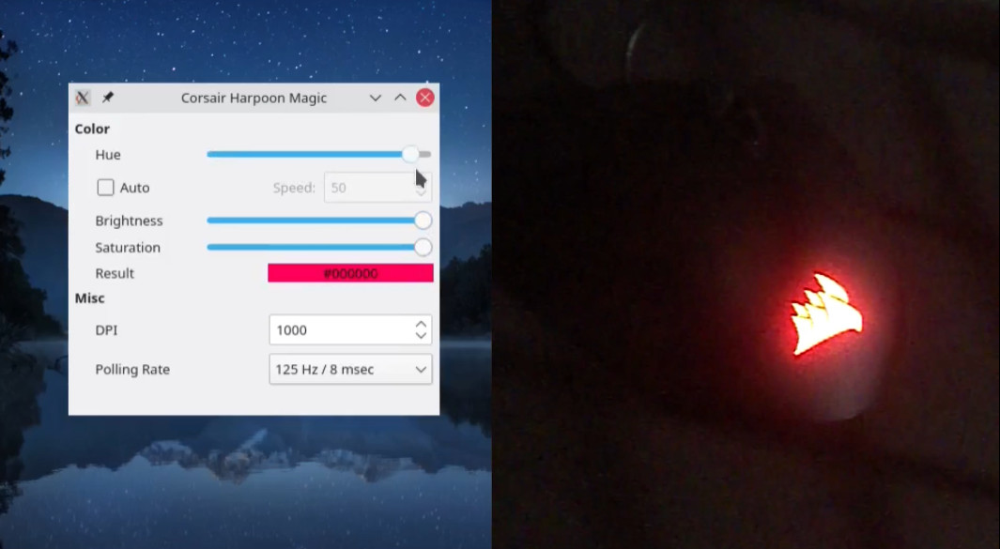

# harpoon-rgb-mouse

DIY Linux driver for the Corsair Harpoon RGB mouse

Learn how it was made: [Crafting simple hardware drivers with libusb](https://z64.me/post/crafting-drivers-libusb/)

See it in action ([YouTube video](http://www.youtube.com/watch?v=GkdJeEKSNBQ))



## Table of Contents

- [Build Instructions](#build-instructions)
  - [Prerequisites](#prerequisites)
  - [Building the Application](#building-the-application)
- [Running Without `sudo`](#running-without-sudo)
  - [Creating a Udev Rule](#creating-a-udev-rule)
- [Usage Examples](#usage-examples)
  - [CLI Application](#cli-application)
  - [GUI Application](#gui-application)

## Build Instructions

### Prerequisites

Before building the application, ensure you have the following installed on your system:

- **Build Essentials**: Compiler and build tools (`gcc`, `g++`, `make`).
- **`libusb-1.0` Development Files**: Required for USB communication with the mouse.
- **Qt Development Tools**: Including `qmake`, `Qt Widgets`, and other necessary Qt libraries.

### Building the Application

1. Clone the Repository

```bash
git clone https://github.com/z64me/harpoon-rgb-mouse.git
cd harpoon-rgb-mouse
```

2. Build the Applications

A build script is provided to compile all components, including the CLI, monitor, and GUI applications.

```bash
./build.sh
```

**What the Script Does**:
- Creates the `bin/linux` directory if it doesn't exist.
- Compiles the CLI application (`harpoon`).
- Compiles the monitor application (`harpoon-monitor`).
- Compiles the Qt GUI application (`harpoon-gui`).
- Places all executables in the `bin/linux` directory.

>Note: The `build.sh` script assumes you have qmake and make in your system's `PATH`. If you have multiple versions of Qt installed, you may need to modify the script to specify the Qt version.


3. Running the Applications

You can run the applications directly from the `bin/linux` directory:

- CLI
  ```bash
  ./bin/linux/harpoon --help
  ```

- GUI
  ```bash
  ./bin/linux/harpoon-gui
  ```

## Running Without `sudo`

By default, accessing USB devices may require root permissions. To allow the applications to communicate with the mouse without running as `sudo`, you can create a udev rule to adjust the device permissions.

### Creating a Udev Rule

1. Identify the Device

The Corsair Harpoon mouse has the following vendor and product IDs:

- Vendor ID: `1b1c`
- Product ID: `1b3c`

2. Create the Udev Rule File

Create a new udev rule file:

  ```bash
  sudo vim /etc/udev/rules.d/99-corsair-harpoon.rules
  ```

3. Add the Following Rule

Paste the following line into the file:

```plaintext
SUBSYSTEM=="usb", ATTR{idVendor}=="1b1c", ATTR{idProduct}=="1b3c", MODE="0666"
```

**Explanation**:
- `SUBSYSTEM=="usb"`: Applies the rule to USB devices.
- `ATTR{idVendor}=="1b1c"`: Matches devices with vendor ID 1b1c.
- `ATTR{idProduct}=="1b3c"`: Matches devices with product ID 1b3c.
- `MODE="0666"`: Sets the permissions so that all users can read and write to the device.

4. Reload Udev Rules

Apply the new udev rule:
  ```bash
  sudo udevadm control --reload-rules
  sudo udevadm trigger
  ```

5. Replug the Mouse

Unplug and reconnect your Corsair Harpoon mouse for the new rules to take effect.

6. Verify Permissions

After updating the udev rules, verify that you can access the device without root permissions:
  ```bash
  ls -l /dev/bus/usb/*/*
  ```
Look for the device matching your mouse's vendor and product IDs and ensure it has the correct permissions (`crw-rw-rw-`).

## Usage Examples

### CLI

The CLI allows you to change mouse settings via command-line options.

#### Setting DPI Mode

Set DPI mode 0 to 1000 DPI with the color black (LED off) and enable only mode 0:

```bash
./bin/linux/harpoon --dpi 0 1000 0x000000 --only 0
```

#### Changing Polling Rate

Set the mouse's polling rate to 500 Hz:

```bash
./bin/linux/harpoon --polling 500
```

#### Using --simple Option

Lock the mouse into one color and precision setting across all modes:

```bash
./bin/linux/harpoon --simple 1000 0xff0000 --only 0
```

### GUI

The GUI provides an interactive interface to adjust mouse settings.
Running the GUI

```bash
./bin/linux/harpoon-gui
```

**Features**:

- DPI Settings: Adjust the DPI value using spin boxes or sliders.
- Polling Rate: Change the polling rate from a drop-down menu.
- LED Color: Use hue, saturation, and brightness controls to adjust the LED color.
- Auto Apply: Enable the auto-apply checkbox to send changes to the mouse in real-time.

